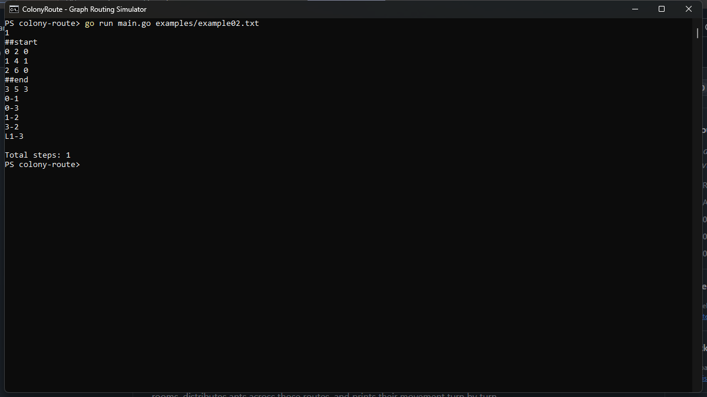

# ColonyRoute: Graph Routing Simulator

A Go command-line application that reads an ant-farm graph from a text file,
finds routes between its start and end rooms, distributes ants across those
routes, and prints their movement turn by turn.

## Screenshot



Actual console output from `go run main.go examples/example02.txt`.

## Features

- **Input parsing:** reads ant counts, room names, coordinates, and tunnel connections.
- **Validation:** checks duplicate rooms and coordinates, invalid links, self-loops,
  and missing or repeated start/end rooms.
- **Graph routing:** uses breadth-first search to find augmenting paths in a
  residual graph.
- **Route allocation:** assigns ants using path length and the number already
  assigned to each route.
- **Movement simulation:** prints ant movements and a total step count.

## Run locally

Install a Go version compatible with the repository's `go.mod`, then run from
the repository root with your input file:

```sh
go run main.go path/to/input.txt
```

To try the bundled example shown above:

```sh
go run main.go examples/example02.txt
```

The input describes the number of ants, rooms with coordinates, start/end
markers (`##start` and `##end`), and tunnel connections such as `room1-room2`.

## Implementation notes

The routing function is named `findPathsEdmondsKarp` and uses BFS with residual
capacity updates. The implementation has not been verified to guarantee
minimum-turn routing or collision-free movement on every graph.

## Authors

Originally created collaboratively by:

- mohaabdulla
- nahussain
- hussainali2
- hcheema
